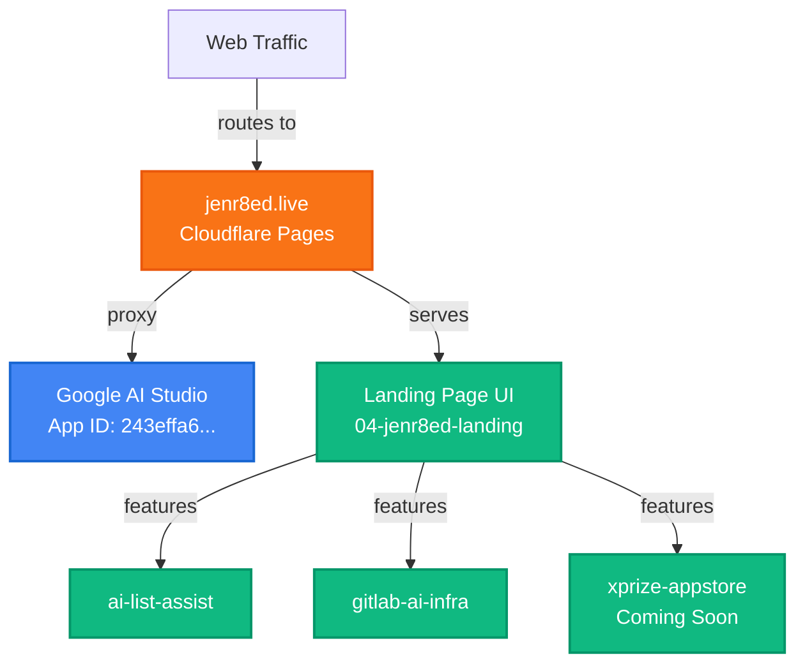

# jenr8ed Deployment Infrastructure Architecture

## Web Traffic Routing Overview

```mermaid
graph TD
    Traffic["Web Traffic"]
    CF["jenr8ed.live<br/>Cloudflare Pages"]:::cloudflare
    AI["Google AI Studio<br/>App ID: 243effa6..."]:::google
    Landing["Landing Page UI<br/>04-jenr8ed-landing"]:::repo
    ALA["ai-list-assist"]:::repo
    GLI["gitlab-ai-infra"]:::repo
    XPS["xprize-appstore<br/>Coming Soon"]:::repo
    
    Traffic -->|routes to| CF
    CF -->|proxy| AI
    CF -->|serves| Landing
    Landing -->|features| ALA
    Landing -->|features| GLI
    Landing -->|features| XPS
    
    classDef cloudflare fill:#f97316,stroke:#ea580c,color:#fff,stroke-width:2px
    classDef google fill:#4285f4,stroke:#1967d2,color:#fff,stroke-width:2px
    classDef repo fill:#10b981,stroke:#059669,color:#fff,stroke-width:2px
```

Generated: 2026-06-27
